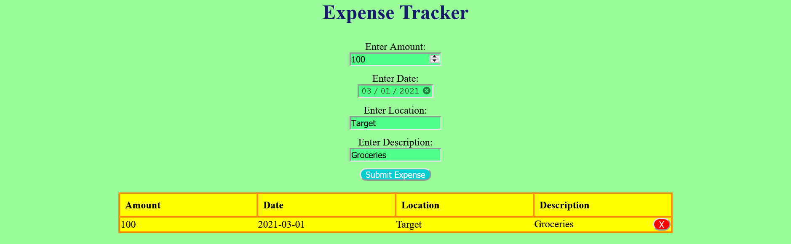

# JavaScript Expense Tracker

An expense tracker created with HTML, CSS, and JavaScript without the use of React.

### Try it out [Here](https://iceeeberg.github.io/Expense-Tracker/)

## Summary 

The application combined all the basic knowledge I have learned about how JavaScript interacts with the DOM.It also introduced on how to create table elements using HTML and how to make them interactive with JavaScript with the use of the DOM. Up to this point, I will say it was the most difficult one for me to create so far.  

## Author 

Dante Leeseberg - Full Stack Sofware Developer [LinkedIn](https://www.linkedin.com/in/dante-leeseberg-bba05883/)
